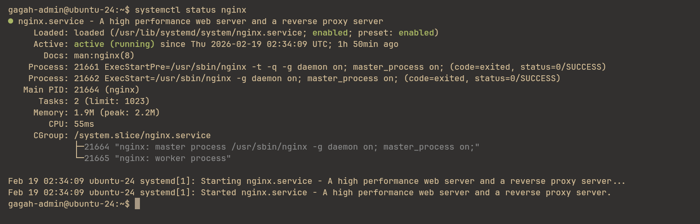
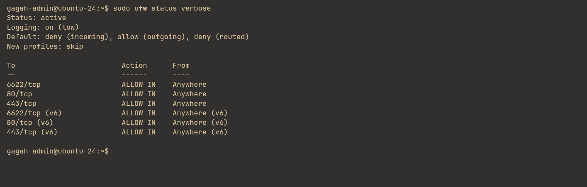
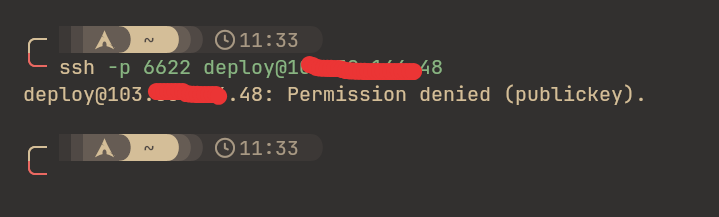
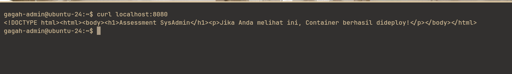

# Laporan Assesment - Gagah

## 1. Troubleshooting

### Masalah
Service nginx tidak dapat di-start dengan menggunakan command:
```bash
sudo systemctl restart nginx
```

Kemudian periksa log dengan command `journalctl -xeu nginx.service`, menghasilkan error berikut:
```bash
Feb 19 02:32:29 ubuntu-24 nginx[21603]: 2026/02/19 02:32:29 [emerg] 21603#21603: unexpected "}" in /etc/nginx/sites-enabled/default:16
```
Error menunjukkan terdapat kesalahan syntax pada file konfigurasi nginx, terutama pada baris ke-16.

Berikut adalah file original `nginx.conf`:
```conf
server {
    listen 80 default_server;
    listen [::]:80 default_server;

    root /var/www/html;
    index index.html index.htm index.nginx-debian.html;

    server_name _;

    location / {
        try_files $uri $uri/ =404;

    # ERROR DISINI: Typo fatal pada directive dan kurang titik koma
    add_header X-Frame-Options "SAMEORIGIN"
    proksi_pass http://localhost:8080
}
```

### Solusi
Terdapat beberapa kesalahan pada file konfigurasi `nginx.conf`:
- kurangnya kurung kurawal (}) pada context `location`
- kesalahan penulisan `proxy_pass` dimana ditulis `proksi_pass`
- kurangnya titik koma (;) pada directive `add_header` dan `proxy_pass`

Konfigurasi `nginx.conf` setelah diperbaiki:
```conf
server {
    listen 80 default_server;
    listen [::]:80 default_server;

    root /var/www/html;
    index index.html index.htm index.nginx-debian.html;

    server_name _;

    location / {
        try_files $uri $uri/ =404;

        add_header X-Frame-Options "SAMEORIGIN";
        proxy_pass http://localhost:8080;
    }
}
```
Kemudian tinggal restart service nginx, dengan command:
```bash
sudo systemctl restart nginx
```

### Bukti


## 2. Security Hardening

### Setup Firewall (UFW)
```bash
# tolak semua akses masuk
sudo ufw default deny incoming

# izinkan port SSH
sudo ufw allow 6622/tcp

# izinkan port HTTP
sudo ufw allow 80/tcp

# izinkan port HTTPS
sudo ufw allow 443/tcp

# enable ufw
sudo ufw enable
```
Output `sudo ufw status`:


### User Creation
Membuat user baru untuk akses SSH:
```bash
sudo useradd -mG adm sudo gagah-admin
```
- Group `adm` berfungsi untuk mengakses direktori log.
- Group `sudo` berfungsi untuk mendapatkan privilege root

### SSH Hardening
Edit file `/etc/ssh/sshd_config.d/50-init-cloud.conf`, ubah `PasswordAuthentication` menjadi `no`:
```conf
# menolak login dengan password
PasswordAuthentication no
```

Edit file `/etc/ssh/sshd_config`, ubah field berikut menjadi `no`:
```conf
# menolak login root
PermitRootLogin no

# menolak login dengan password
PasswordAuthentication no
```

Tambahkan public key untuk mengakses user `gagah-admin`, (dijalankan di client):
```
ssh-copy-id -p 6622 gagah-admin@10x.xxx.xxx.xx
```

### Bukti
Tidak dapat login menggunakan password pada user `deploy`:


## 3. Containerization
Kontainerisasi aplikasi nginx dengan non-root container pada image alpine.

### Dockerfile
```Dockerfile
FROM nginx:1.28.2-alpine3.23

WORKDIR /app

COPY nginx.conf /etc/nginx/nginx.conf

COPY index.html /usr/share/nginx/html/index.html


RUN chown -R 1000:1000 /usr/share/nginx/html \
                     /var/cache/nginx \
                     /var/log/nginx \
                     /etc/nginx/conf.d \
    && touch /tmp/nginx.pid \
    && chown 1000:1000 /tmp/nginx.pid

USER 1000:1000

EXPOSE 8080
```
Build dengan command:
```bash
sudo docker build --tag app-test:1902261031 .
```
Dijalankan menggunakan command:
```bash
sudo docker run --detach --restart always --name app-test --publish 8080:8080 app-test:1902261031
```
### Bukti
Berikut bukti akses ke port `8080` local:


## 4. Automation
Otomatisasi backup dan mengatur retention backup ke 7 hari.

### Script
Script untuk backup log nginx pada direktori `/var/log/nginx` dalam bentuk `.tar` dan menghapus file backup lebih dari 7 hari:
```bash
#!/bin/bash

FILENAME=$(date +"%Y-%m-%d")
WORKING_DIRECTORY="/home/gagah-admin/backup"

cd $WORKING_DIRECTORY

# Backup log directory
tar -czvf log-backup-$FILENAME.tar.gz -C /var/log nginx

# Delete backup files older than 7 days 
find /home/gagah-admin/backup -type f -mtime +7 -exec rm {} +
```

### Crontab
Cron untuk menjalankan script jam 02 pagi setiap hari:
```cron
0 2 * * * /home/gagah-admin/scripts/nginx-backup.sh
```

## 5. Architecture Design

### Kasus
Aplikasi di soal nomor 3 memiliki traffic yang tinggi, sehingga menyebabkan penggunaan CPU cenderung 100% dan performa database mulai berkurang.

### Solusi

Berikut beberapa solusi rekomendasi yang dapat menangani kendala CPU 100% dan database yang pelan:
1. Horizontal Scale
Untuk menangani penggunaan CPU yang tinggi, diperlukan server tambahan atau menambahkan server pada kluster.

Proses upgrade tidak menimbulkan downtime yang signifikan sehingga lebih aman dan traffic tetap terjaga.

Agar tidak menimbulkan downtime, dapat menggunakan teknik `load balancing` untuk mengatur traffic yang masuk ke server agar terdistribusi secara merata, dan memastikan ketersediaan atau `high availability` sehingga meminimalisir downtime.

2. Database Scaling
Jika solusi nomor 1 tidak dapat mengatasi performa database, maka direkomendasikan untuk membuat server khusus untuk database, tentunya dengan `high availability`.

Strategi yang digunakan yaitu `replication`, dimana terdapat beberapa server yang memiliki salinan database persis satu sama lain. Terdapat `primary` server untuk menangani operasi `write` dan `follower` untuk menangani operasi `read`.

Strategi `replication` juga membutuhkan `load balancing` agar traffic terdistribusi dan memastikan `high availability`.

Solusi ini cukup kompleks namun akan lebih terjamin untuk masa yang akan mendatang jika server memerlukan tambahan resources lagi.
